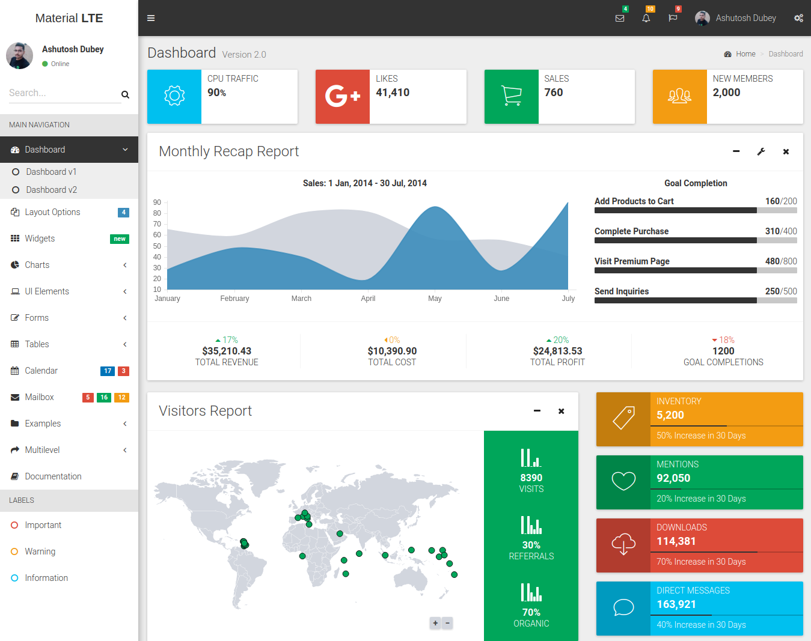
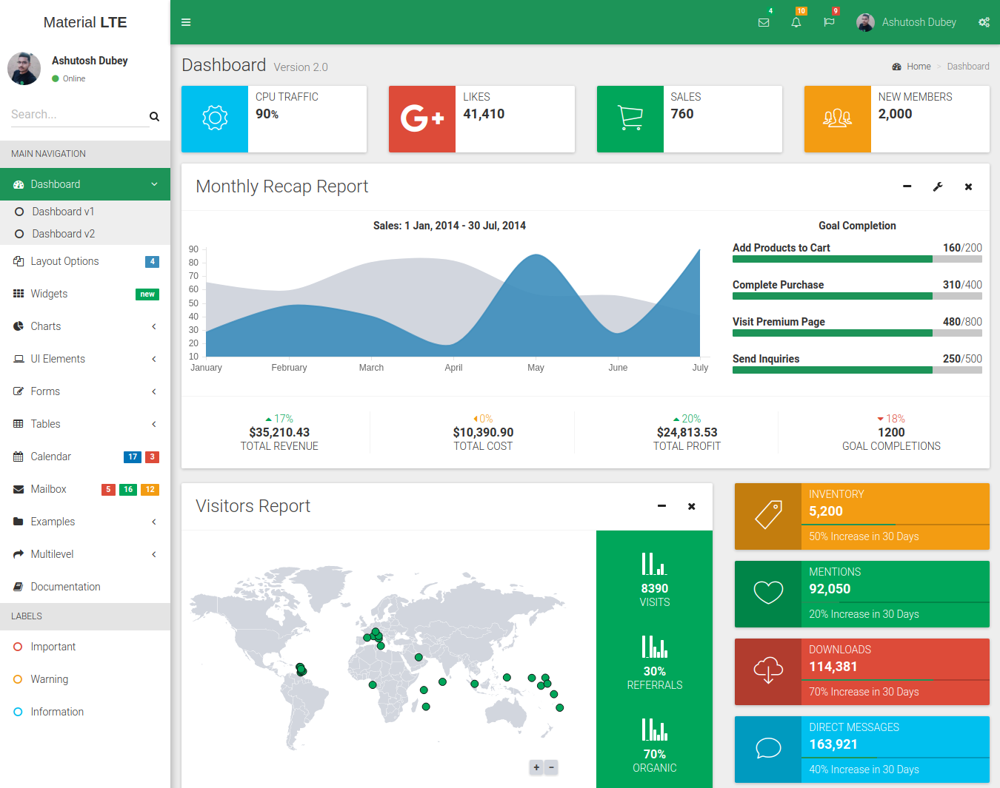
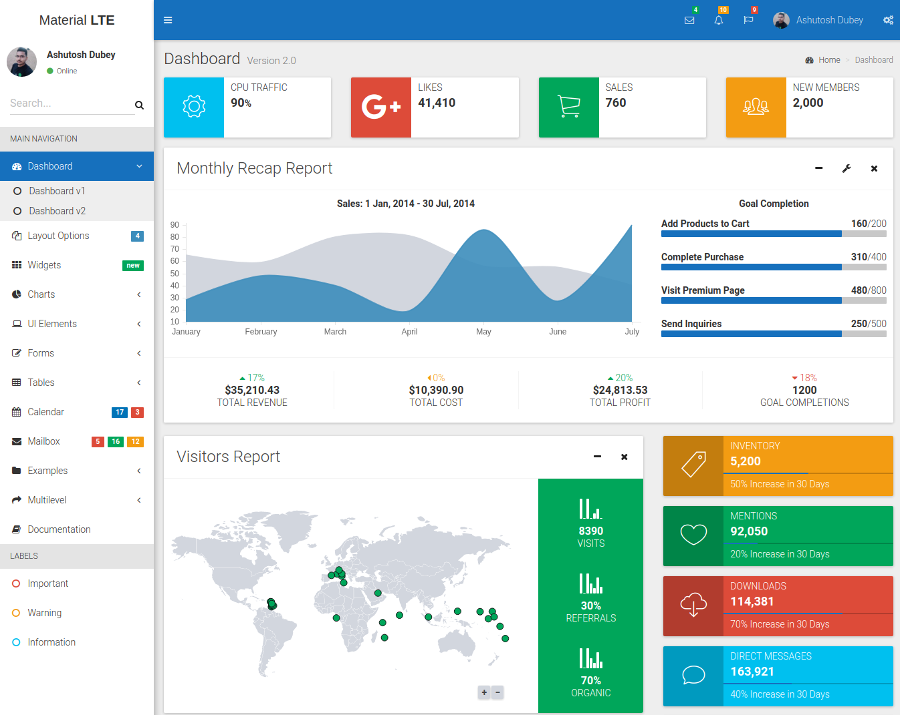

# MaterialLTE
A Material version of AdminLTE 2 
# Install Instruction 
Open Your terminal and type
``` 
git clone https://github.com/webkodes/materiallte.git
```
And there you go you have it 
# Black Version

# Green Version

# Blue Version

